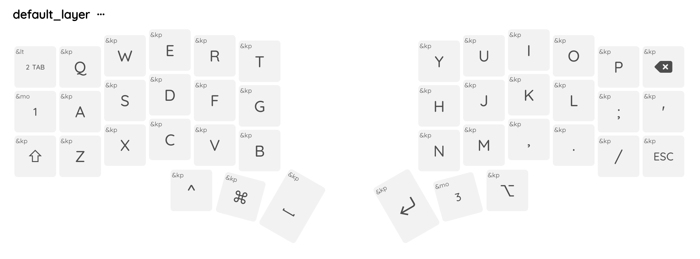
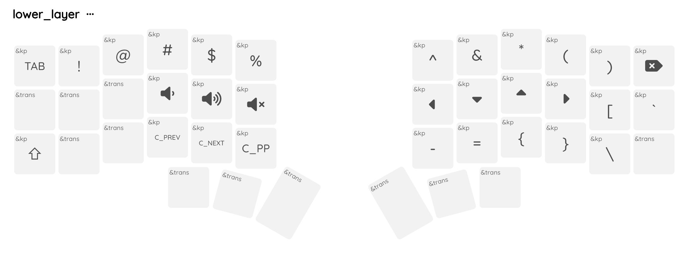
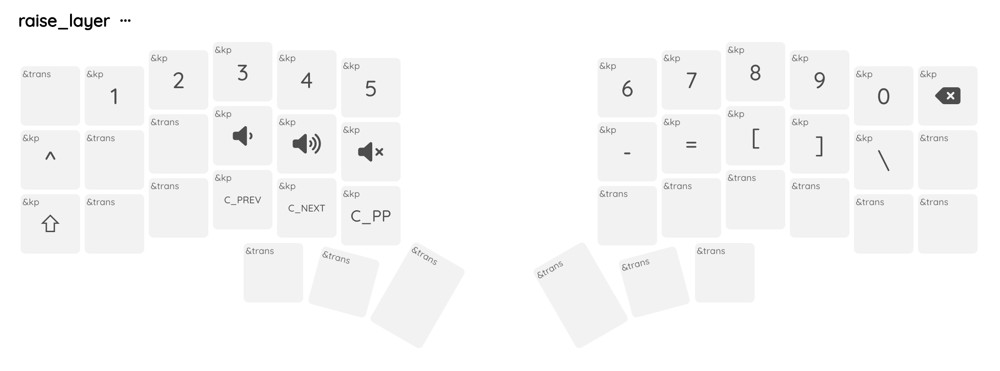
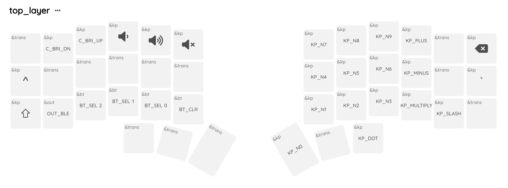
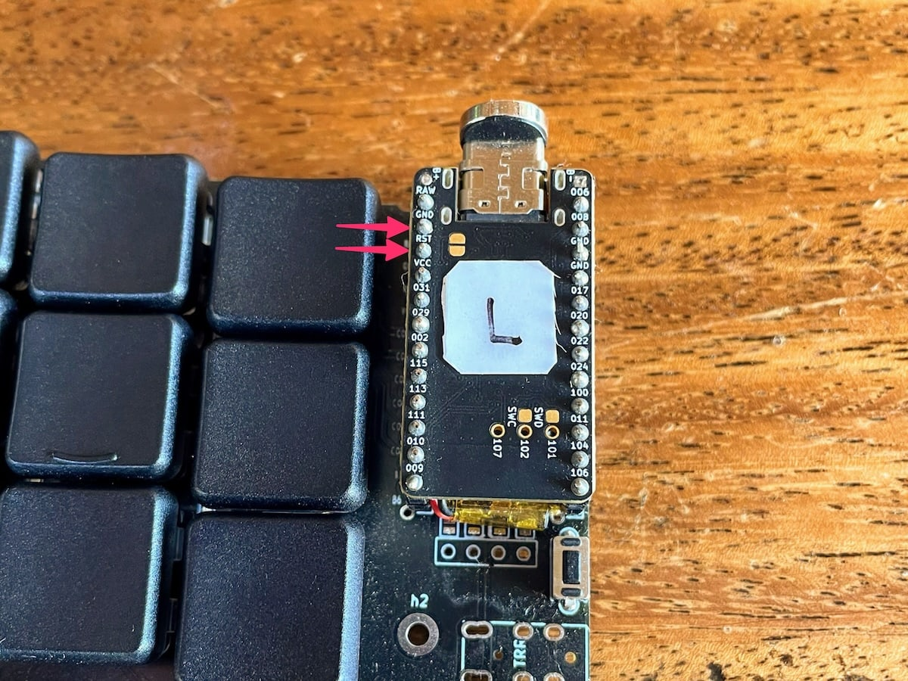

# Armno's ZMK firmware

ZMK firware for my Corne wireless split keyboard with nice!nano controllers.

## Keymaps

Steps to update the keymaps (which I always forget).

- Make changes in `corne.keymap` using [Keymap Editor](https://nickcoutsos.github.io/keymap-editor/) and push to github
- Wait for [GitHub Actions](https://github.com/armno/zmk-config/actions) to finish the build. Then download the artifacts.
- Put the keyboard into the bootloader mode by pressing the reset button twice.
  - or, use a tweezer to short circuit `RST` and `GND` pins (see the pictures below). When success, there should be a storage drive named `NICENANO` shows up in the Finder.
- Connect the left keyboard to the computer via USB. **Use a proper USB-C cable** and not the magnetic one.
- Copy the left firmware to the `NICENANO` storage. When success, the storage will be automatically unmounted.
- Repeat steps for the right side keyboard.

## Troubleshooting

### 2 parts unable to pair

Most likely I'll need to fix it with the reset firmware. See https://zmk.dev/docs/troubleshooting#split-keyboard-halves-unable-to-pair

The left keyboard's switch is also not very good. Better leave if on all the time.
